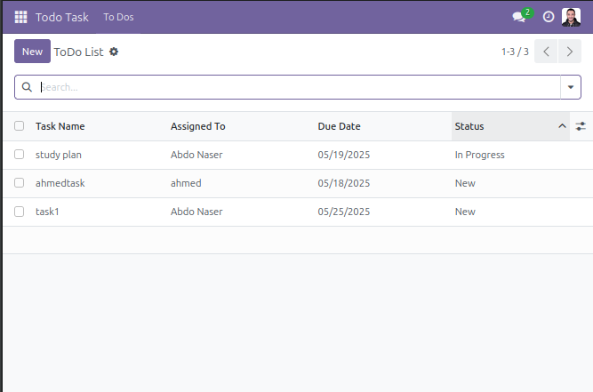
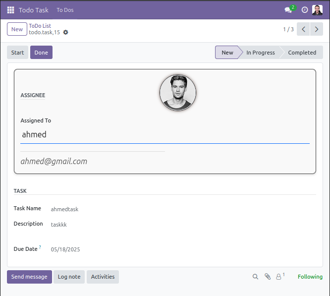
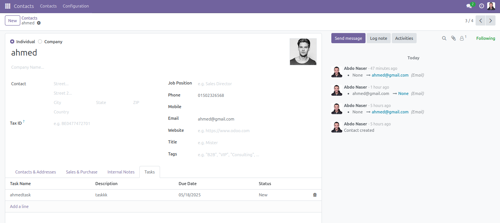

```markdown
# To‑Do Management ‑ Odoo 17 Module

A lightweight yet polished task‑tracking addon for Odoo 17.  
Assign tasks to any contact, set deadlines, follow progress, and keep the chatter in one place.

---

## Key Features

| Feature                          | Details                                                              |
| -------------------------------- | -------------------------------------------------------------------- |
| **Per‑contact task list**        | Each _res.partner_ gets a _Tasks_ tab showing every assignment.      |
| **Status workflow**              | `New → In Progress → Completed` with one‑click buttons & statusbar.  |
| **Deadline guardrails**          | Prevents past due‑dates; auto‑suggests +7 days if empty.             |
| **Unique‑per‑assignee name**     | DB‑level constraint: no duplicate task titles for the same person.   |
| **Auto‑notifications**           | Mail/activity mixin means followers & the assignee stay in the loop. |
| **Avatar & contact info inline** | Clean form layout: photo, partner, and e‑mail in one glance.         |
| **Search / Group By shortcuts**  | Quick filters for status, overdue, assignee, or due‑date.            |
| **Tree & Kanban ready**          | Tree view shipped; drop‑in kanban possible.                          |

---

## Screenshots

| Task Form                        | Task List                        | Partner Tab                            |
| -------------------------------- | -------------------------------- | -------------------------------------- |
|  |  |  |

---

## Usage

1. **Contacts › Tasks Tab**
   _Create_ a task right from the partner form or open the _To‑Do List_ menu.

2. **Status Buttons**
   _Start_ moves a task to _In Progress_; _Done_ marks it _Completed_.

3. **Chatter**
   Discuss, log notes, or schedule additional activities—built‑in with `mail.thread`.

4. **Filters**
   Use the search view for quick slices: _New_, _In Progress_, _Completed_, or _Overdue_ (shows any deadline < today).

---

## Technical Highlights

- **Models**

  - `todo.task` (`toDoTask.py`)

    - Inherits `mail.thread`, `mail.activity.mixin`
    - SQL constraint: `unique(task_name, assign_to)`
    - Python constraints for due‑date & e‑mail

  - `res.partner` extension adds `task_ids` (One2many Relation)

- **Views**

  - Custom form/tree/search in `toDoTask_view.xml`
  - Partner form inheritance (`res_partner_view.xml`)

- **Assets**

  - Extra backend CSS (`static/src/css/todo.css`) for avatar/field layout.

- **Access Control**

  - Basic security file included—adapt groups/rights as needed.

---

## Author & Maintainer

**Abdelrahman Naser**
[LinkedIn](www.linkedin.com/in/abdelrahman-naser-muhammed) • [GitHub](https://github.com/abdonaser)
```
